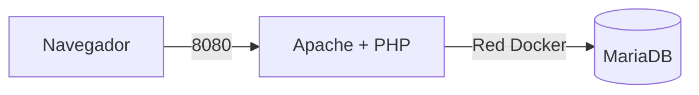

 	 Práctica final RA1 - Salón recreativo  - Jose Carbonell Benito    2ASIR

## Descripción

En esta práctica he montado una web de un salón recreativo con un ranking de jugadores. He usado Docker con dos servicios: **Apache + PHP** para la web y **MariaDB** para la base de datos.

PHP se ejecuta en el servidor y consulta MariaDB. JavaScript se ejecuta en el navegador del usuario. La web está disponible por el puerto **8080**.

## Arquitectura



El navegador entra por el puerto 8080 y el contenedor web se comunica con MariaDB por la red interna de Docker usando el nombre `db`.

## Despliegue

### Local

```bash
docker compose up -d --build
docker compose ps
```

Web: `http://localhost:8080`

Para parar:

```bash
docker compose down
```

### Play with Docker

```bash
git clone URL_DEL_REPOSITORIO
cd salon-recreativo
docker compose up -d --build
docker compose ps
```

Antes de levantarlo hay que crear el fichero `.env` con las credenciales.

## Preguntas de la práctica

### ¿Por qué no pasamos la contraseña de root al servicio web?
Porque la aplicación no necesita permisos de administrador. Es más seguro utilizar el usuario `jugador`, que solo tiene los permisos necesarios.

### ¿Sobre qué base de datos tiene permisos jugador?
Con `SHOW GRANTS;` obtuve:

```text
GRANT USAGE ON *.* TO `jugador`@`%`
GRANT ALL PRIVILEGES ON `arcade`.* TO `jugador`@`%`
```

Por tanto, `jugador` tiene permisos sobre la base de datos `arcade`.

### ¿Por qué no usamos root desde la aplicación?
Porque root tiene permisos sobre todo MariaDB y la aplicación no los necesita. Usar `jugador` limita los permisos y es más seguro.

### Diferencia entre `docker compose down` y `docker compose down -v`
`docker compose down` elimina los contenedores y la red, pero mantiene el volumen y los datos.

`docker compose down -v` también elimina el volumen `db_data`. Al volver a levantar los contenedores se crea un volumen nuevo y `init.sql` vuelve a ejecutarse.

### ¿Qué es un Dockerfile?
Es un fichero con las instrucciones para construir una imagen Docker. En esta práctica lo he usado para partir de `php:8.3-apache`, instalar `mysqli` y copiar la web:

```dockerfile
FROM php:8.3-apache
RUN docker-php-ext-install mysqli
COPY src/ /var/www/html/
```

### ¿Por qué no instalamos mysqli a mano?
Porque al borrar el contenedor se perdería. Al ponerlo en el Dockerfile se instala automáticamente cada vez que reconstruimos la imagen.

### ¿Qué se ejecuta en servidor y qué en cliente?
PHP se ejecuta en el servidor y se conecta a MariaDB. JavaScript se ejecuta en el navegador del usuario.

### ¿Por qué las horas pueden ser diferentes?
Porque PHP usa la hora del servidor o contenedor y JavaScript usa la hora del ordenador del usuario. Si tienen zonas horarias distintas, las horas no coinciden.

## Seguridad

### `.env` fuera de Git
Lo comprobé con:

```bash
git ls-files
```

Aparece `.env.example`, pero no `.env`.

### Puerto 3306
Con:

```bash
docker compose ps
```

MariaDB aparece como `3306/tcp`, pero no como `0.0.0.0:3306->3306/tcp`, por lo que no está publicado hacia el host.

### Usuario de la aplicación
La aplicación se conecta con el usuario `jugador`, no con root.

### Versiones de Apache y PHP
Lo comprobé con:

```bash
curl -I http://localhost:8080
```

Resultado:

```text
HTTP/1.1 200 OK
Server: Apache
Content-Type: text/html; charset=UTF-8
```

No aparece la versión de Apache ni `X-Powered-By`. Para conseguirlo utilicé `ServerTokens Prod`, `ServerSignature Off` y `expose_php = Off`.

## Monedas

- **Moneda 1:** `ARC-7X3K` — encontrada con `SELECT * FROM ranking;`
- **Moneda 2:** `ARC-Q9M2` — apareció al funcionar correctamente la conexión PHP-MariaDB.

## Problemas que encontré

Al principio Docker no funcionaba porque Docker Desktop no estaba iniciado. Lo solucioné arrancando Docker Desktop y volviendo a ejecutar:

```bash
docker compose up -d --build
```

También fue necesario instalar `mysqli` porque la imagen `php:8.3-apache` no la llevaba. Lo solucioné añadiéndola al Dockerfile y reconstruyendo la imagen.